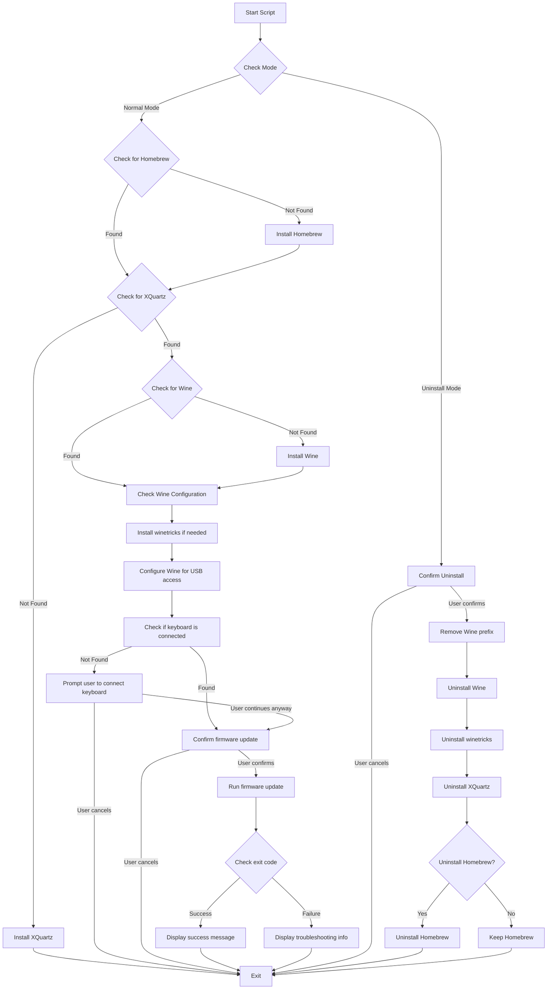

# Cherry KC 1000 SC Firmware Update Tool for macOS


A shell script solution to update the firmware of Cherry KC 1000 SC keyboards on macOS using Wine, eliminating the need for a Windows virtual machine.

## The Problem

Cherry KC 1000 SC keyboards are experiencing issues on macOS where keystrokes are either ignored or repeated. Cherry provides a firmware update that fixes these issues, but it's only available as a Windows executable.

## The Solution

This project provides a shell script that:

1. Automatically installs all required dependencies (Homebrew, Wine, XQuartz, winetricks)
2. Configures Wine with the necessary components for USB device access
3. Detects if the Cherry keyboard is connected
4. Runs the firmware update tool through Wine
5. Provides detailed error handling and troubleshooting information

## Why Wine Instead of a VM?

While a Windows virtual machine would work for updating the firmware, the Wine approach has several advantages:

- **Smaller footprint**: ~1GB vs 20GB+ for a Windows VM
- **Faster setup**: Minutes vs hours for a full VM
- **No Windows license required**: Saving cost and complexity
- **Simpler for end users**: Single script vs VM setup and configuration

## Installation and Usage

1. Clone this repository:
   ```bash
   git clone https://github.com/yourusername/cherry-kc1000-firmware-updater.git
   cd cherry-kc1000-firmware-updater
   ```

2. Make the script executable:
   ```bash
   chmod +x update_cherry_firmware.sh
   ```

3. Connect your Cherry KC 1000 SC keyboard to your Mac

4. Run the script:
   ```bash
   ./update_cherry_firmware.sh
   ```

   For reduced output verbosity, use the quiet mode:
   ```bash
   ./update_cherry_firmware.sh --quiet
   ```

   For help with available options:
   ```bash
   ./update_cherry_firmware.sh --help
   ```

5. Follow the on-screen instructions

   To uninstall all components installed by the script:
   ```bash
   ./update_cherry_firmware.sh --uninstall
   ```

## Script Workflow



## Requirements

- macOS 10.15 or later
- Internet connection (for downloading dependencies)
- Cherry KC 1000 SC keyboard
- Admin privileges (for installing software)

## Command Line Options

The script supports the following command line options:

| Option | Description |
|--------|-------------|
| `-q, --quiet` | Reduce output verbosity |
| `-u, --uninstall` | Remove all installed components |
| `-h, --help` | Show help message |

## Uninstallation

If you no longer need the firmware update tool, you can use the uninstall option to clean up all installed components:

```bash
./update_cherry_firmware.sh --uninstall
```

This will:
1. Remove the Wine prefix directory (`~/.wine-cherry-firmware`)
2. Uninstall Wine and winetricks using Homebrew
3. Uninstall XQuartz using Homebrew
4. Optionally uninstall Homebrew itself (you'll be prompted)

The uninstallation process is interactive and will ask for confirmation before removing components.

## Troubleshooting

If you encounter issues with the firmware update:

1. **Wine security prompt**: Follow the on-screen instructions to approve Wine in System Preferences > Security & Privacy
2. **Keyboard not detected**: Disconnect and reconnect your keyboard, then try again
3. **XQuartz issues**: Make sure to log out and log back in after installing XQuartz
4. **Wine configuration**: Try running `wineboot --init` in Terminal to reinitialize Wine
5. **Windows components installation**: If you encounter issues with Windows components, try removing the marker file with `rm ~/.wine-cherry-firmware/.cherry_components_installed` and run the script again

## License

This project is licensed under the MIT License - see the LICENSE file for details.
